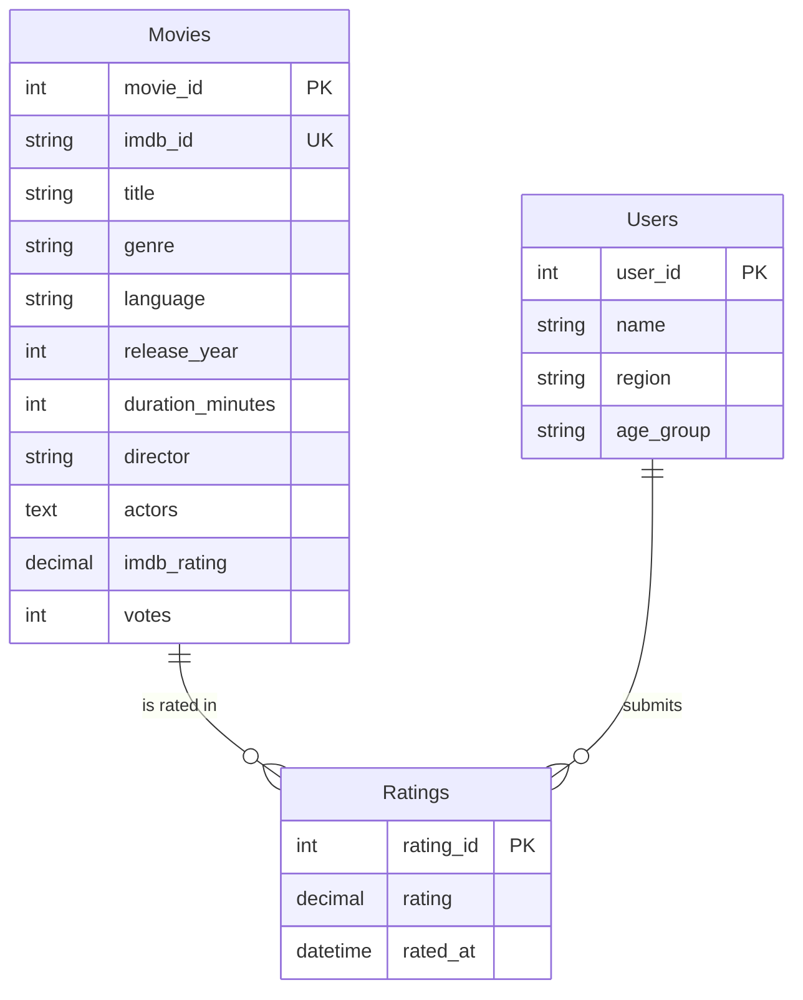

# BollywoodLens ER Diagram

## Talking points for viva/demo

- **Movies** stores the master catalogue; `imdb_id` keeps it aligned with the public IMDb dataset.
- **Users** represents viewers who will eventually interact with the recommendation engine.
- **Ratings** resolves the many-to-many relationship and records each interaction, enabling analytics such as average rating per genre or per user cohort.
- The design supports future growth: sharding by language, adding `Directors` or `Actors` tables, and attaching ML pipelines without changing the core schema.
